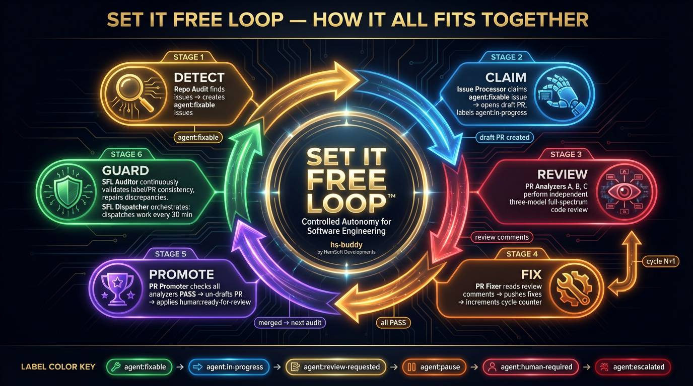

# hs-buddy

> Your universal productivity companion

[](https://www.typescriptlang.org/)
[](https://www.electronjs.org/)
[](https://reactjs.org/)
[](https://vitejs.dev/)
[](docs/SET_IT_FREE_GOVERNANCE.md)

## Overview

**hs-buddy** is a desktop application built to help you manage your work and personal life. It sits on top of the HemSoft skills infrastructure (110+ skills), providing a beautiful interface to automate tasks, manage workflows, and access information from various sources all in one place.

## Features

- **Tree View Navigation**: Organize tools and views in a familiar left-sidebar structure
- **Pull Request Viewer**: Beautiful UI for viewing and managing your GitHub PRs
- **GitHub Integration**: Deep integration with GitHub pull requests, issues, and repositories
- **Unified Dashboard**: All your important information in one place

## Tech Stack

- **Electron 30** - Cross-platform desktop framework
- **React 18** - UI framework
- **TypeScript** - Type-safe development
- **Vite** - Lightning-fast build tool
- **Allotment** - Resizable split panes

## Installation

### Prerequisites

- **Node.js 22+** - [Download](https://nodejs.org/)
- **Bun** (optional, for faster package management) - [Install](https://bun.sh/)

### Setup

```bash
# Clone the repository
git clone https://github.com/relias-engineering/hs-buddy.git
cd hs-buddy

# Install dependencies
bun install
# or with npm
npm install

# Optional: copy .env.example to .env for first-launch account auto-migration
cp .env.example .env
# Edit VITE_GITHUB_USERNAME and VITE_GITHUB_ORG if you want auto-migration on first launch

# Start development
npm run dev
# or with bun
bun run dev
```

### Configuration

hs-buddy uses **electron-store** for persistent configuration and **GitHub CLI** for authentication:

- **Windows**: `%APPDATA%\hs-buddy\config.json`
- **macOS**: `~/Library/Application Support/hs-buddy/config.json`
- **Linux**: `~/.config/hs-buddy/config.json`

#### First-Time Setup

1. **Install GitHub CLI** (if not already installed):

   ```bash
   # Windows (winget)
   winget install GitHub.cli

   # macOS (Homebrew)
   brew install gh

   # Or download from: https://cli.github.com/
   ```

2. **Authenticate with GitHub CLI**:

   ```bash
   gh auth login
   ```

   Follow the prompts to authenticate. GitHub CLI will securely store your credentials in your system keychain.

3. **Verify authentication**:

   ```bash
   gh auth status
   ```

4. **(Optional) Auto-migration from environment variables**:
   If you have a `.env` file with `VITE_GITHUB_USERNAME` and `VITE_GITHUB_ORG`, hs-buddy will automatically create your first account in the config on launch.

#### Adding GitHub Accounts

You can add multiple GitHub accounts for monitoring different organizations:

1. Click **Settings** in the sidebar
2. Click "Open in Editor" to edit `config.json`
3. Add accounts to the `github.accounts` array:

```json
{
  "github": {
    "accounts": [
      {
        "username": "your-username",
        "org": "your-org"
      },
      {
        "username": "work-username",
        "org": "work-org"
      }
    ]
  }
}
```

**Note**: All accounts share the same GitHub CLI authentication. No tokens are stored in config or environment variables!

#### Security

- **No tokens in config files** - Authentication is handled by GitHub CLI
- **System keychain storage** - Credentials are stored securely by your OS
- **No `.env` file needed** - After migration, you can delete it
- **Safe to commit config.json** - Contains no sensitive data (just usernames and org names)

## Convex Backend

hs-buddy uses [Convex](https://docs.convex.dev) as its serverless backend for real-time data sync.

```bash
# Start Convex dev server
./runServer.ps1          # or: bun run convex:dev

# Start the Electron app
./runApp.ps1             # or: bun dev

# Generate Convex types
bun run convex:codegen

# Deploy to production
bun run convex:deploy
```

Local dashboard (when dev server is running): <http://127.0.0.1:6790/>

## Development

```bash
# Start development server
npm run dev

# Type checking
npm run typecheck

# Linting
npm run lint
npm run lint:fix

# Formatting
npm run format
npm run format:check

# Build for production
npm run build
```

## Project Structure

```text
hs-buddy/
├── electron/               # Main process (Electron)
│   ├── ipc/               # IPC handlers (13 modules)
│   ├── services/          # Copilot & crew client services
│   ├── workers/           # AI/exec/dispatcher workers
│   ├── main.ts            # Window management, menus, IPC
│   └── preload.ts         # Secure context bridge
├── src/                   # Renderer process (React)
│   ├── api/               # GitHub API client
│   ├── features/          # Feature modules (budget discovery, quota projection, task queue)
│   ├── components/        # React components
│   │   ├── automation/        # Automation/schedule UI
│   │   ├── copilot-usage/     # Copilot usage panels
│   │   ├── crew/              # Crew (multi-agent) UI
│   │   ├── pr-review/         # PR review panels
│   │   ├── pr-threads/        # PR thread panels
│   │   ├── pull-request-list/ # Pull request list panels
│   │   ├── repo-detail/       # Repository detail panels
│   │   ├── planner/           # Task planner UI
│   │   ├── sessions/          # Session history panels
│   │   ├── settings/          # Settings panels
│   │   ├── shared/            # Shared components
│   │   ├── sidebar/           # Sidebar components
│   │   ├── sidebar-panel/     # Sidebar panel containers
│   │   ├── bookmarks/         # Bookmark management panels
│   │   └── tempo/             # Tempo timesheet panels
│   ├── hooks/             # React hooks
│   ├── providers/         # React context providers
│   ├── services/          # Renderer-side services
│   ├── types/             # TypeScript types
│   ├── utils/             # Utilities
│   ├── App.tsx            # Main application component
│   └── main.tsx           # React entry point
├── convex/                # Serverless backend functions
├── scripts/               # Helper scripts
├── assets/                # Images and design assets
├── public/                # Static assets
├── dist/                  # Vite build output (renderer)
├── dist-electron/         # Electron build output (main)
└── release/               # Packaged application binaries
```

## Keyboard Shortcuts

| Shortcut                        | Action            |
| ------------------------------- | ----------------- |
| `F11`                           | Toggle fullscreen |
| `Ctrl+R` / `Cmd+R`              | Reload window     |
| `Ctrl+Shift+I` / `Cmd+Option+I` | Toggle DevTools   |

## Troubleshooting

You can also run the validation script to check your GitHub org configurations:

```powershell
.\scripts\validate-github-orgs.ps1
```

## Roadmap

### Phase 1: Foundation

- [x] Scaffold Electron + React project
- [x] Tree view navigation
- [x] PR viewer (first use case)
- [x] electron-store configuration system
- [x] Settings UI
- [ ] Multi-account GitHub support (architecture ready)
- [ ] Bitbucket integration

### Phase 2: Integration

- [ ] Skills browser
- [ ] Task management
- [ ] Notifications

### Phase 3: Advanced Features

- [ ] Dashboard views
- [ ] Custom layouts
- [ ] Plugin system

## Set it Free Loop

This repository is governed by the **Set it Free Loop™** — a recursive automation system that detects quality findings, implements fixes on a draft PR, reviews them with multiple AI models, and hands clean pull requests to humans for the final merge decision.

<p align="center">
  
</p>

The loop runs continuously via GitHub Actions workflows:

| Stage                  | Workflow            | What it does                                                                       |
| ---------------------- | ------------------- | ---------------------------------------------------------------------------------- |
| **Detect**             | Repo Audit          | Scans for documentation drift, stale artifacts, config hygiene                     |
| **Detect**             | Simplisticate Audit | Identifies unnecessary complexity and dead code                                    |
| **Claim**              | Issue Processor     | Claims `agent:fixable` issues and opens draft PRs                                  |
| **Review**             | PR Analyzers A/B/C  | Three independent AI models perform full-spectrum code review                      |
| **Implement / Revise** | Issue Processor     | Creates the first draft PR and applies follow-up analyzer feedback on later cycles |
| **Route**              | PR Label Actions    | Route blocked PRs back to the implementer and flip clean PRs to ready-for-review   |
| **Guard**              | SFL Auditor         | Repairs issue/PR label discrepancies and enforces one-issue-one-PR harmony         |

Human involvement is required for the final merge decision on every SFL PR. Low-risk fixes can still be prepared autonomously, but merging is human-owned.

> **Note**: The Discussion Processor is an event-driven workflow triggered when a GitHub Discussion is labeled. It is not a scheduled pipeline stage — audit workflows create `agent:fixable` issues directly.

See [SET_IT_FREE_GOVERNANCE.md](docs/SET_IT_FREE_GOVERNANCE.md) for the full policy including label taxonomy, retry limits, merge authority matrix, and escalation paths.

## Contributing

This is a personal productivity tool by HemSoft Developments. While contributions are welcome, please note this project is tailored to specific workflows and may not suit general use cases.

## License

MIT © HemSoft Developments

## Acknowledgments

Built upon the architecture of [hs-conductor](https://github.com/HemSoft/hs-conductor).
