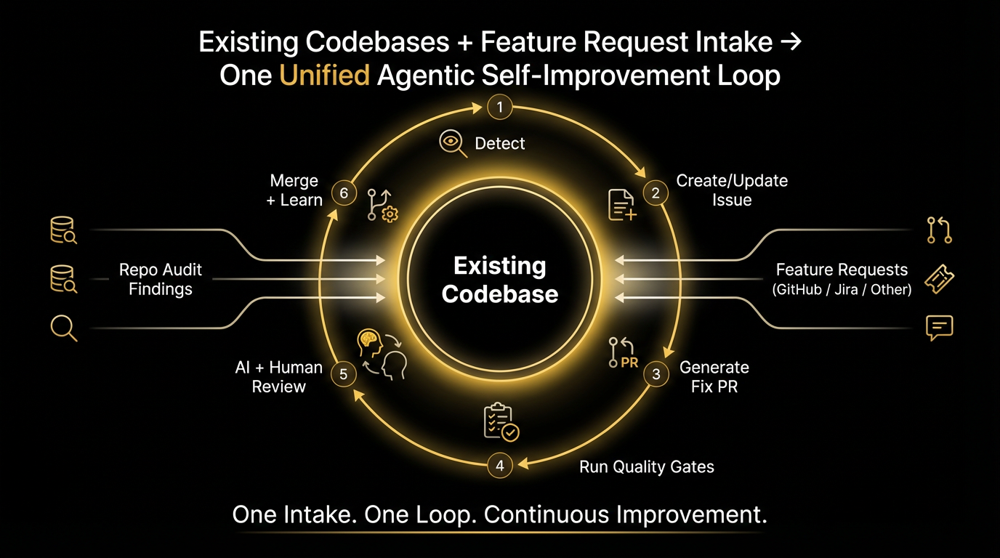
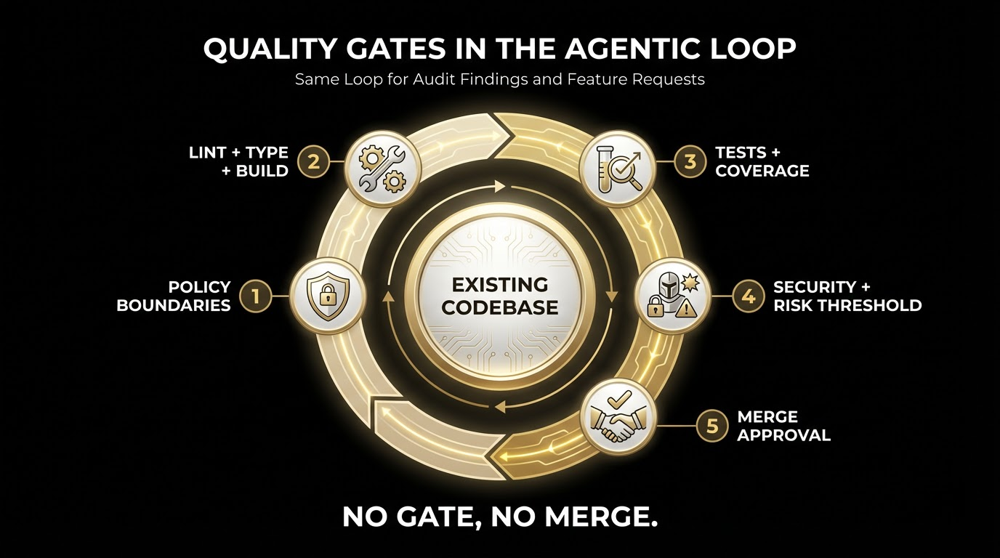
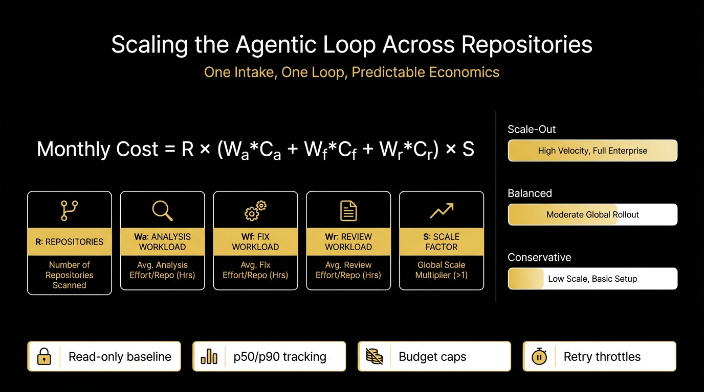
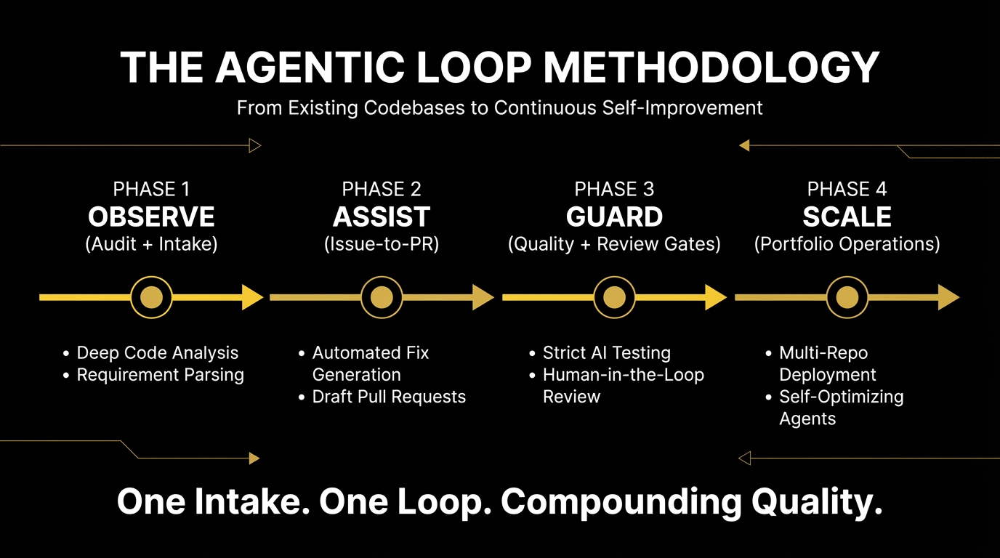

# Solving Software Engineering Development through the art of the Agentic Loop — The Agentic Loop Methodology™: One Intake. One Loop. Compounding Quality. 🚀

Software engineering is shifting from one-off automation to **self-improving systems**.

What we explored in this repository is not a gimmick. It is a viable pattern:

1. Detect problems continuously.
2. Convert findings into trackable work.
3. Generate and validate fixes.
4. Gate quality with deterministic checks.
5. Re-run analysis until confidence is high.
6. Ship, close the loop, and learn.

This document captures the practical recipe.

---

## Naming the Movement: The Agentic Loop Methodology™

Breakthrough engineering eras are remembered because they are named, shared, and repeated.

This approach deserves a clear identity:

- **Name**: **The Agentic Loop Methodology™**
- **Tagline**: **One Intake. One Loop. Compounding Quality.**
- **Core Promise**: Convert every signal (quality finding or feature request) into governed, measurable software delivery.

### Why this name works

- **Agentic** captures intelligence and adaptive reasoning.
- **Loop** captures continuous recursive improvement.
- **Methodology** signals this is an operational system, not a one-off script.

### The short form for teams

When socializing this internally, use:

- **ALM** — Agentic Loop Methodology

Example: "This repo is ALM-enabled: all intake routes into the same quality-gated loop."

---

## 1) Core Thesis

The future of engineering operations is a **controlled recursive loop**:

- **Agentic intelligence** finds and reasons about issues.
- **Deterministic CI/CD** enforces objective quality.
- **Governance guardrails** prevent runaway automation.
- **Feedback loops** steadily improve repo health and delivery velocity.

This is not “replace engineers.” It is “amplify engineers with systems that never forget to check quality.”

---

## 2) What We Built Here (Concrete, Not Hypothetical)

In this repo, we established:

- `gh aw`-based workflows (GitHub Agentic Workflows) using source markdown + compiled lock YAML.
- A daily status pattern (`daily-repo-status`) that can generate a report issue.
- A weekly audit pattern (`weekly-repo-audit`) that can create an issue with findings.
- Safe output constraints so write actions are explicit and bounded.

### Why the lock YAML is huge

The large `.lock.yml` file is generated runtime infrastructure:

- sandboxing
- model runtime bootstrapping
- MCP gateway setup
- safe output schemas
- artifact upload
- redaction and failure handling
- policy and security controls

Your authored logic remains in the concise `.md` workflow source file.

---

## 3) The Agentic Loop Pattern

### Loop Stages

1. **Observe**
   - Scheduled repo-audit scans repository state.
2. **Convert to work**
   - Audit emits one or more actionable issues.
3. **Fix**
   - A fixer workflow takes eligible issues and opens PRs.
4. **Verify**
   - CI quality gates run (lint, typecheck, tests, coverage, security).
5. **Review**
   - A PR-analysis workflow checks risk/severity and blocks weak PRs.
6. **Resolve**
   - Merge when thresholds pass; close linked issue(s).
7. **Learn**
   - Record outcomes and tune prompts/rules/thresholds.

### Key Property

The system is recursive, but **bounded** by explicit controls.

---

## 4) Architecture Layers

### A) Intent Layer (Human-Friendly)

- Authored as `*.md` workflow specs.
- Defines purpose, scope, output style, and task behavior.
- Example: `weekly-repo-audit.md`.

### B) Execution Layer (Machine-Hardened)

- Compiled to `*.lock.yml` via `gh aw compile`.
- Handles runtime, model invocation, sandbox, and safety wrappers.

### C) Governance Layer

- Safe outputs and output limits (e.g., max issues per run).
- Branch protections and required checks.
- Label-based controls and escalation policies.

### D) Quality Layer

- Deterministic validators: lint, markdownlint, typecheck, tests, coverage, security scan.
- These are objective pass/fail gates around agent-generated changes.

---

## 5) Quality Gates for Recursive Automation

To make recursion safe and useful, stack gates in this order:

1. **Policy Gate**
   - Allowed tools, allowed paths, write limits.
2. **Syntax Gate**
   - formatting, markdownlint, static validation.
3. **Compilation Gate**
   - typecheck/build must pass.
4. **Test Gate**
   - unit/integration tests + minimum coverage.
5. **Security Gate**
   - secret scanning, dependency review, SAST where relevant.
6. **Risk Gate**
   - agent review severity threshold (e.g., no critical findings).
7. **Merge Gate**
   - only after all required statuses are green.

---

## 6) Guardrails That Prevent Infinite Loops

For autonomous systems at scale, these are mandatory:

- **Max retries per issue** (e.g., 2)
- **Max spawned issues per parent** (e.g., 3)
- **Idempotency key** per finding (avoid duplicates)
- **Single active audit issue per category**
- **Stop labels** (e.g., `agent:pause`, `agent:human-required`)
- **Escalation rule** after repeated failure
- **Time window controls** to avoid noisy churn

If any guardrail trips, route to human triage and halt recursion.

---

## 7) The `gh aw` Operating Model (Practical)

### Authoring

- Edit source workflow markdown under `.github/workflows/*.md`.

### Compiling

- Run `gh aw compile` to generate `.lock.yml`.

### Running

- Manual: GitHub Actions "Run workflow"
- CLI: `gh aw run <workflow-id>`
- Scheduled via cron in frontmatter

### Inspecting

- `gh aw status`
- `gh aw logs <workflow-id>`
- GitHub Actions artifacts and summaries

### Model Behavior

- Engine: Copilot
- If no explicit model variable is set (`GH_AW_MODEL_AGENT_COPILOT`), model selection is default/auto-routed by platform.
- For deterministic behavior, set the variable explicitly.

---

## 8) Blueprint: Multi-Workflow Agentic Factory

### Workflow 1 — Weekly Repo Audit

- Trigger: weekly + manual
- Output: one report issue, tagged and standardized
- Scope: docs drift, config hygiene, stale artifacts, cross-reference accuracy

### Workflow 2 — Issue-to-PR Fixer

- Trigger: labeled audit issues (e.g., `agent:fixable`)
- Action: generate focused fix branch + PR
- Constraints: safe path allowlist, low/medium-risk findings only

### Workflow 3 — PR Quality Analyzer

- Trigger: PR opened/synchronized
- Action: assess severity/risk and post findings
- Rule: fail gate if critical/high above threshold

### Workflow 4 — Merge Orchestrator (Optional)

- Trigger: all required checks green
- Action: auto-merge + close linked issue
- Rule: skip if escalation labels exist

---

## 9) Feature Request Intake Process (Closing the Loop Completely)

This is the missing piece that turns maintenance automation into full software delivery automation.

### Canonical Intake Principle

No matter where requests originate (GitHub Issues, Jira, ServiceNow, support forms, Slack triage),
**normalize all feature requests into GitHub Issues** as the canonical queue for the repository.

Once normalized, feature work can flow through the exact same Agentic Loop as defect and quality work.

### Unified Intake Flow

1. **Ingest**
   - Pull new requests from external systems on a schedule or webhook trigger.
2. **Normalize**
   - Convert to a standard issue template with: problem, desired outcome, acceptance criteria,
     risk class, and business impact.
3. **Classify**
   - Auto-label by type (`feature`, `enhancement`, `platform`, `ux`), severity, and team ownership.
4. **Decompose**
   - Agent suggests implementation slices and dependencies.
5. **Execute**
   - Issue-to-PR workflow creates scoped implementation PRs.
6. **Gate**
   - Same recursive quality gates (lint, tests, security, review thresholds).
7. **Resolve + Sync Back**
   - Merge, close issue, and optionally post completion back to Jira or source system.

### Why This Matters

- One queue model for all work: defects, debt, quality, and features.
- One delivery pipeline with consistent governance.
- One telemetry model for cost, cycle time, and reliability.

This is how the system becomes a **complete engineering operating model**, not just an audit bot.

### Practical Integration Pattern (Any Ticketing System)

- Keep your source of demand where teams already work (Jira, support desk, etc.).
- Add a lightweight sync process that creates or updates GitHub Issues with stable external IDs.
- Store linkage metadata (e.g., `external-system`, `external-key`) in issue body/frontmatter/labels.
- Treat GitHub Issue state as delivery truth for automation.
- Push status transitions back outward when needed.

### Anti-Drift Controls for Intake

- Deduplicate by external key + semantic similarity.
- Require acceptance criteria before auto-implementation.
- Auto-route ambiguous requests to human triage.
- Cap automatic issue fan-out from a single feature request.

With this pattern, feature requests and code-quality findings are both first-class citizens in the same loop.

---

## 10) Cost Predictions at Scale (Hundreds of Repos)

Cost depends on frequency, model choice, and loop depth.

Use this envelope formula:

\[
\text{Monthly Cost} \approx R \times (W_a C_a + W_f C_f + W_r C_r) \times S
\]

Where:

- \(R\): number of repositories
- \(W_a\): audit runs per repo per month
- \(W_f\): fixer runs per repo per month
- \(W_r\): review runs per repo per month
- \(C_a, C_f, C_r\): average cost per run
- \(S\): safety multiplier for retries/spikes (recommended: 1.2 to 1.5)

### Example Scenarios (Planning Model)

These are planning estimates, not billing guarantees.

#### Scenario A — Conservative (100 repos)

- Weekly audit only
- \(W_a=4, W_f=0, W_r=0\)
- Assume \(C_a=\$0.20\), \(S=1.2\)

\[
100 \times (4 \times 0.20) \times 1.2 = \$96/month
\]

#### Scenario B — Balanced (100 repos)

- Weekly audit + light fixing + PR analysis
- \(W_a=4, W_f=2, W_r=6\)
- Assume \(C_a=\$0.20, C_f=\$0.35, C_r=\$0.15, S=1.3\)

\[
100 \times (4*0.20 + 2*0.35 + 6*0.15) \times 1.3
= 100 \times 2.40 \times 1.3
= \$312/month
\]

#### Scenario C — Scaled (300 repos)

- Balanced pattern scaled linearly

\[
300 \times 2.40 \times 1.3 = \$936/month
\]

### Practical Budgeting Advice

- Start with read-only or issue-only mode for baseline measurement.
- Capture real per-run metrics for 2–4 weeks.
- Use p50/p90 cost-per-run to forecast instead of guesses.
- Apply hard monthly budget caps and throttle non-critical runs.

---

## 11) Rollout Strategy (0 → 100+ Repos)

### Phase 1: Observe (Weeks 1–2)

- Audit only, no code changes
- One issue per run
- Tune signal quality and false positive rate

### Phase 2: Assisted Fixing (Weeks 3–6)

- Auto-PR only for low-risk categories
- Human review required for merge
- Measure fix success and rework rate

### Phase 3: Guarded Autonomy (Weeks 7+)

- Add auto-merge for tightly bounded classes
- Keep strict hard gates and escalation controls
- Expand repo count gradually

---

## 12) KPIs That Prove Value

Track these monthly:

- Mean time to detect documentation/config drift
- Mean time to remediation for audit findings
- % of agent-generated PRs merged without manual rewrites
- False positive rate of audit findings
- Cost per resolved issue
- Engineering hours saved

If these improve while quality gates remain green, the system is working.

---

## 13) Final Thesis

The Agentic Architecture of the future is not “AI writes code.”

It is:

- **AI + deterministic gates + governance + feedback loops**
- operating as a **continuous engineering quality system**
- at repository scale, then organization scale.

That is how software engineering evolves from reactive maintenance into a proactive, self-healing development system.

And yes: this has massive potential.
