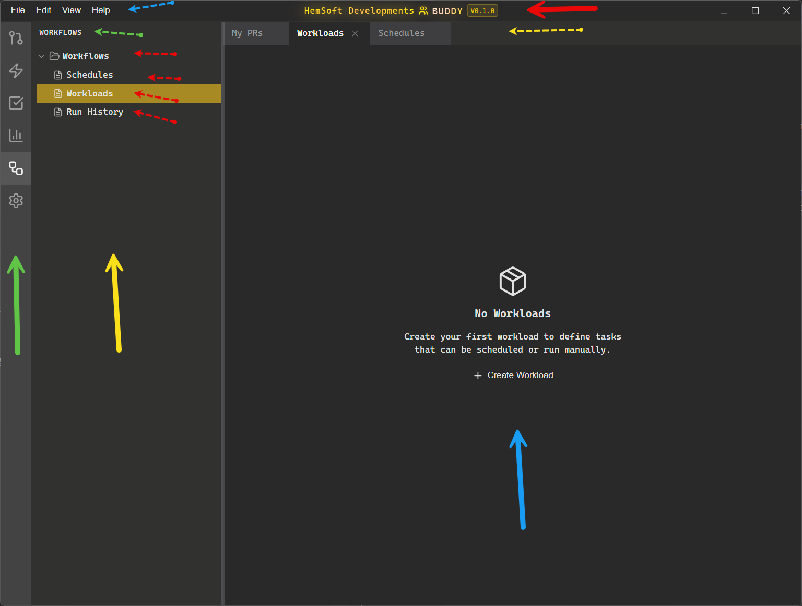

# Verbiage

Project terminology dictionary.

## Solid Arrows

| Arrow     | Term              | Definition                                                                                                                                                                       |
| --------- | ----------------- | -------------------------------------------------------------------------------------------------------------------------------------------------------------------------------- |
| 🟢 Green  | **Activity Bar**  | Vertical icon strip on the far left of the app for switching between major sections (GitHub, Skills, Tasks, Insights, Automation, The Crew, Tempo, Bookmarks, Copilot, Settings) |
| 🟡 Yellow | **Sidebar Panel** | The panel adjacent to the Activity Bar that displays context-specific tree views and navigation items for the selected section                                                   |
| 🔵 Blue   | **Editor Area**   | The main content area where views are rendered (e.g., PR lists, settings forms, job editors). Also called "Main Content"                                                         |
| 🔴 Red    | **Title Bar**     | The custom frameless window title bar displaying "HemSoft Developments BUDDY" with version number                                                                                |

## Dotted Arrows

| Arrow     | Term               | Definition                                                                                                      |
| --------- | ------------------ | --------------------------------------------------------------------------------------------------------------- |
| 🟢 Green  | **Section Header** | The label at the top of the Sidebar Panel identifying the current section (e.g., "AUTOMATION", "PULL REQUESTS") |
| 🟡 Yellow | **Tab**            | Individual tab in the Tab Bar representing an open view, with label and close button                            |
| 🔵 Blue   | **Menu Bar**       | The horizontal menu strip containing File, Edit, View, and Help menus (rendered in the custom Title Bar)        |
| 🔴 Red    | **Sidebar Items**  | The clickable tree items within the Sidebar Panel (e.g., "Schedules", "Jobs", "Runs")                           |

## Additional UI Components

| Term                | Definition                                                                |
| ------------------- | ------------------------------------------------------------------------- |
| Tab Bar             | Horizontal strip below the Menu Bar showing all open tabs                 |
| Allotment           | The resizable split pane system separating Sidebar Panel from Editor Area |
| Badge               | Small count indicator shown next to Sidebar Items (e.g., PR counts)       |
| Content Placeholder | The welcome/empty state shown when no tabs are open                       |

## Automation Terminology

| Term            | Definition                                                                                                                                  |
| --------------- | ------------------------------------------------------------------------------------------------------------------------------------------- |
| **Automation**  | The main section for task scheduling and execution (formerly "Workflows")                                                                   |
| **Job**         | A task definition that can be scheduled or run manually. Jobs have a worker type (exec, ai, skill) and configuration. (formerly "Workload") |
| **Schedule**    | A cron-based trigger that runs a Job at specified intervals                                                                                 |
| **Run**         | An execution instance of a Job, with status tracking (pending, running, completed, failed) (formerly "Run History")                         |
| **Worker Type** | The execution engine for a Job: `exec` (shell commands), `ai` (LLM prompts), `skill` (Claude skills)                                        |
